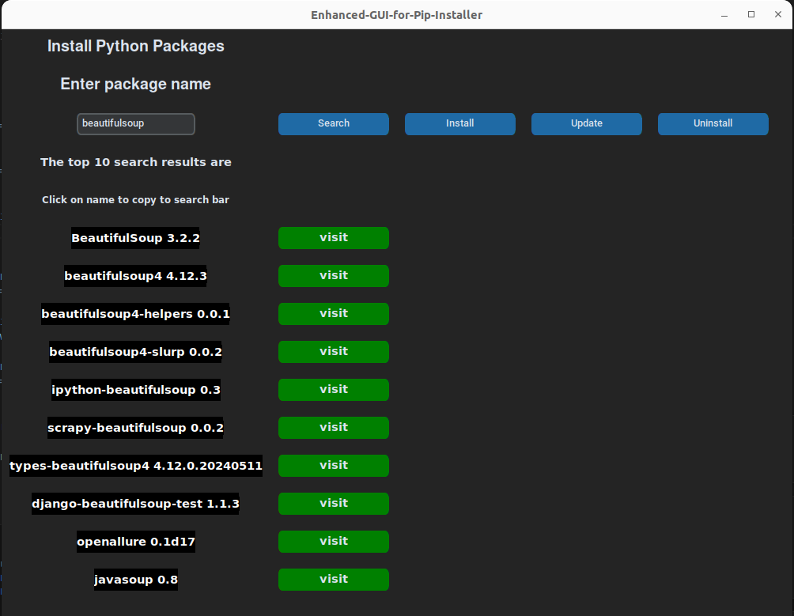

# Pip Installer GUI with Enhanced Search Functionality

This project is a graphical user interface (GUI) built using Tkinter for managing Python packages. It allows users to search for packages on PyPI (Python Package Index) and perform operations such as install, upgrade, or uninstall directly from the interface. The application also displays the top 10 search results from PyPI.

## Features

- **Search PyPI:** Type a package name and search on PyPI.org.
- **Top 10 Results:** Display the top 10 search results from PyPI.
- **Package Management:** Install, upgrade, or uninstall packages.
- **User-friendly Interface:** Easy-to-use interface for managing Python packages.

## Prerequisites

Before you begin, ensure you have met the following requirements:

- You have Python 3.x installed.
- You have pip (Python package installer) installed.

## Installation

1. Clone the repository:

    ```sh
    git clone https://github.com/Sreeharij/Enhanced-GUI-for-Pip-Installer.git
    cd pip-installer-gui
    ```

2. Install the required packages:

    ```sh
    pip install -r requirements.txt
    ```

## Usage

1. Run the application:

    ```sh
    python3 Gui-pip-Installer.py
    ```

2. The GUI will open. Use the search bar to type in the name of the package you want to search for and click the "Search" button.

3. The top 10 search results from PyPI will be displayed.

4. Select a package from the list (it's corresponding package name will be typed out in the search bar) and choose to install, upgrade, or uninstall it.

## Interface


## License

This project is licensed under the MIT License. See the [LICENSE](LICENSE) file for details.
